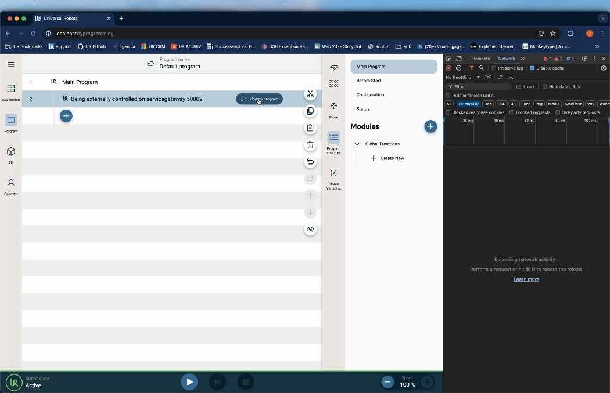

# External Control URCap

This URCap allows you to send script code to the robot, and is primarily meant for connecting the robot to the Universal ROS/ROS2 driver, Isaac Sim driver, and the Universal Robots Client Library.


## Build and Deploy Sample

In order to build and deploy this sample, use the commands below. A rebuild of the project is required to see any changes made to the source code.  If you are deploying the URCap to URSim, ensure that you have started the simulator.

### Dependencies

Run this command to install the dependencies of the project.

```shell
npm install
```

### Build

Run this command to build the contribution type.

```shell
npm run build
```

### Installation

Run this command to install the built URCap to the simulator.

```shell
npm run install-urcap
```

Run this command to install the built URCap to the robot.

```shell
npm run install-urcap -- --host <robot_ip_address>
````

## Backend Contribution

This URCap uses a Flask framework to run a REST server on port 5000. 

### Backend Output

Having built and installed the URCap in the simulator you can open your terminal to see the output from the backend:

```shell
docker exec -it ursim-polyscopex-runtime-1 bash
```

You can find more documentation on the `docker exec` functionality [here](https://docs.docker.com/reference/cli/docker/container/exec/).

Your terminal prompt should have switched from `psxdev@<vsc_container_id>:/pwd/$ ` to `<ursim_container_id>:/pwd/# `, meaning you can now execute commands within your simulator docker container.

Inside the simulator docker container, you can view the backend output using the docker `logs` functionality. The following will show the terminal output from the `universal-robots_external-control_external-control-backend`:

```shell
docker logs -f universal-robots_external-control_external-control-backend
```

## Frontend Contribution

The frontend contribution is built in Angular using no external libraries. 

### Application Node
The application node contains two input fields. Enter your computer host IP address and desired port into the corresponding fields and press the confirm button. These fields will dictate the REST endpoint used to retrieve the robot program.

### Program Node
The program node will reflect the computer host IP address and socket port that was entered in the application node. If you make any changes to the program externally, you will need to press the "Update program" button.

## Frontend Output
When the update program button is pressed, you will see a new fetch call in the network section of the browser inspector. You can see the script code being sent to the robot in the response section of the fetch response. When the program is played, the robot will execute the script code. 



## URSim Implementation 

This section will explain which networks to use in order to connect URSim to a ROS/ROS2 driver Docker container with the External Control URCap.

### URSim Network
In order to find the IP address of the URSim, run 

```shell
docker inspect ursim-polyscopex-runtime-1 bash
```

Look at the Networks section of the output. It shoudl look something like this 

```json 
"Networks": {
    "bridge": {
        "IPAMConfig": null,
        "Links": null,
        "Aliases": null,
        "MacAddress": "02:42:c0:a8:d7:03",
        "NetworkID": "1125e40f93f2506020d7191589013c7b286467afaf82a03e82f28c5ac05ce794",
        "EndpointID": "e7b0ca51f027950aab1df40669b946b5815e9553cd83228ea4038633d76e36e8",
        "Gateway": "192.168.215.1",
        "IPAddress": "192.168.215.3",
        "IPPrefixLen": 24,
        "IPv6Gateway": "fd07:b51a:cc66:1::1",
        "GlobalIPv6Address": "fd07:b51a:cc66:1:0:242:c0a8:d703",
        "GlobalIPv6PrefixLen": 64,
        "DriverOpts": null,
        "DNSNames": null
    }
}
```

The IP address that you will use in your ROS/ROS2 driver is the IPAddress field. In this case, it would be `192.168.215.3`. 

### Driver Network 

Use `host.docker.internal` in the computer host IP address field in the Application Node of the URCap. Make sure that your driver container is run with this argument.

```docker
 --network="host"
 ```